# LDTS_<09><03> - SPACE INVADERS

## Game Description

The main idea of the project was to develop a game not too complex, and so, the idea of Space Invaders came up.

It is a game, which original and first version was developed and launched in 1978, of the shoot-em-up genre (arcade style), where the goal is to defeat a wave of descending aliens trying to make their way towards the player.

The player controls a spaceship, along the horizontal axis, that fires bullets in an upwards trajectory to make its enemies die before reaching it, and collecting points along the way. The enemies are grouped in a square-like formation and keep descending through the screen towards the spaceship. They can and should be killed to avoid player's death. If the player has no remaining lives then the game ends and the player has to restart the whole process again.

We agreed upon this game due to its popularity and impact in the industry and pop culture.

This project was developed by *Bernardo António Gonçalves* (*up202108745*@fe.up.pt), *Pedro Estela* (*up202108892*@fe.up.pt) and *Rodrigo Rodrigues* (*up202108847*@fe.up.pt).

## Gameplay

  

  <b><i>Game GIF</i></b>

 
 

## Screenshots

The following screenshots serve as an example for the game and its different menus:

  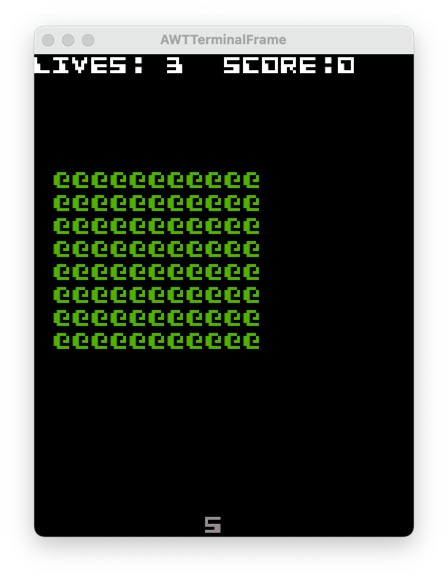

  <b><i>1. Level example</i></b>

 
 

  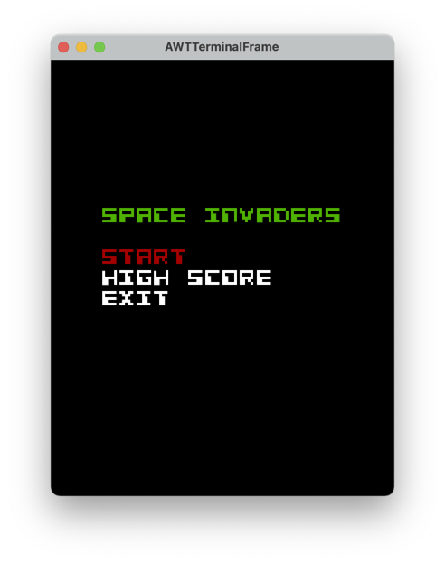

  <b><i>2. Game's menu</i></b>

 
 

  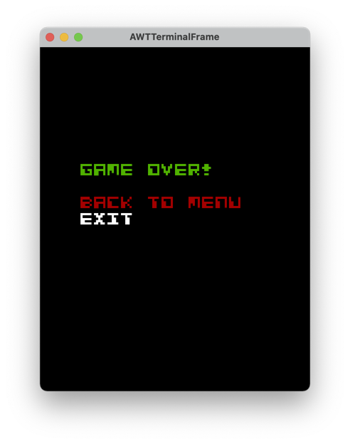

  <b><i>3. Lost game</i></b>

 
 

  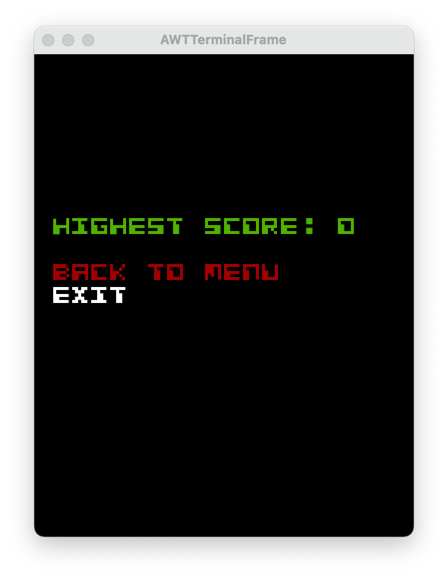

  <b><i>4. High score menu</i></b>

 
 

## Implemented Features
- **Shooting** - the game will have a simple shooting mechanic, where the player-controlled spaceship will fire a bullet that travels in a straight line in an upwards trajectory upon pressing the spacebar.
- **Aliens chase spaceship** - the enemies will spawn grouped in waves and make their way towards the player after traversing the entire screen horizontally, descending gradually, and, if unkilled, will eventually catch up to the player’s spaceship.
- **Collision system** - Neither the spaceship nor the aliens can go out of bounds and the collision between both are verified to ensure playability.
- **Scoring system** - each attempt to beat the game includes a score relative to the ongoing attempt. Points can be earned through killing alien invaders. Each session the player starts will also keep record of the highest score for the player to keep track of his progress.
- **Connected Menus** - Easy navigability through game menus.
- **Friendly GUI** - Very interactive menus and easily understanded

## Planned Features

Every intended feature was implemented in the final game version.

## UML view

  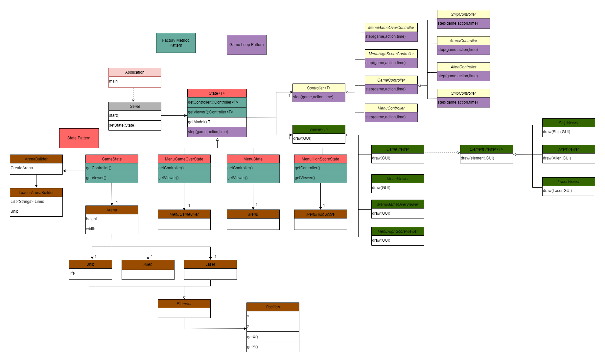

  <b><i>UML overview</i></b>

 
 

## Design
### Program States
#### Problem:
Game being divided in different states.

#### Used Pattern:
Since we wanted the code to do different actions depending on the "state" of the game, we immediately thought about the **_State Pattern_**.

  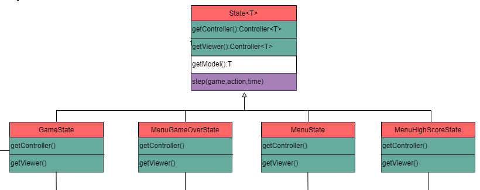

  <b><i>1. State pattern</i></b>

 
 

#### Implementation:
Being a behavioural design pattern, meaning that it alters its behaviour depending on the need of the program, we can transition from one state to another to help navigate the user's needs.
For example, before starting a game, we can transition from MenuState to GameState, and after losing all lives we can go back to MenuState.

#### Consequences:
This patterns benefits design in the following way:
- Well organized code respecting the Single Responsiblity Principle.
- Also respecting the Open Closed Principle, allowing to add other states if needed.

### Program Structure
#### Problem:
Main focus was on how to structure and build up our program. A specific pattern came to mind.

#### Used Pattern:
To solve our problem, the **_Architectural Pattern_** was implemented, the Model-View-Controller (GUI) to be exact. It helps separating the concepts and code.

  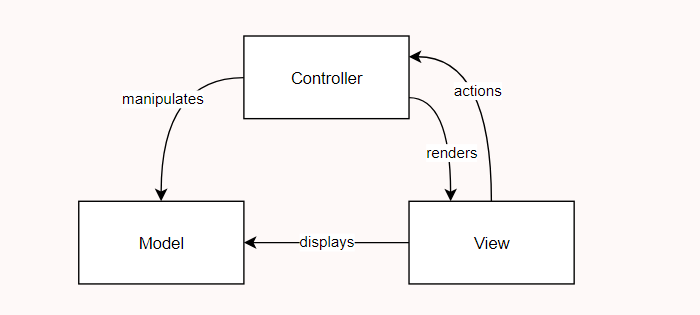

  <b><i>2. Model-View-Controller style</i></b>

 
 

#### Implementation:
It helps structure and separate code that does different tasks.
The model represents only the data. The view displays the data and sends user action to controller. The controller provides the data to the view and interprets user's actions.

#### Consequences:
This patterns benefits design in the following way:
- Independence of presentation and data
- Independence of input, controller and view.
- New features can be easily implemented.

### Strategy
#### Problem:
When expanding our game in features, we came across the repetition of some code that could be specified.

#### Used Pattern:
So, to solve this problem, we tried the **_Strategy Method_**.
Since we wanted to use some parts of classes in a more specific way, we extracted the part of the class that does something specific, and implemented them afterwards using the specificity of the new code we wanted to implement.
We had some related classes that differed only in behaviour.

  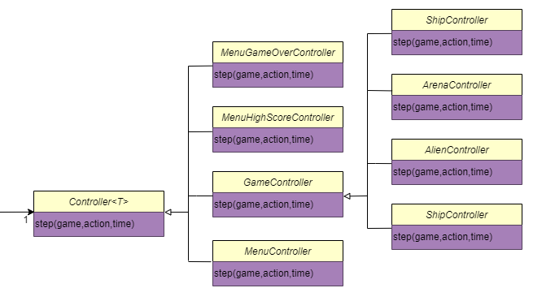

  <b><i>3. Strategy pattern</i></b>

 
 

#### Implementation:
We identified some part of code that we were changing multiple times, and extracted it to its own class. We then implemented that part of code by calling the class, making it easier to implement new features.

#### Consequences:
This patterns benefits design in the following way:
- This class favours the open-closed principle.
- We isolated the implementation details of an algorithm from the code that actually uses it.

### Confusional Creation
#### Problem:
We started running into complicated and confusing code when creating new instances, and we needed to simplify it, in order to get clearer and more comprehensible code.

#### Used Pattern:
To simplify and clean up code, we used the **_Factory Method_**, which suggests exactly the solution we needed to our problem.
It separates object construction calls in a new class instead of building a object in the code.

  

  <b><i>4. Factory pattern</i></b>

 
 

#### Implementation:
The main creator calls upon the specific subclass to create each type of desired, specifically the _GameState_ or the _MenuState_

#### Consequences:
- This pattern favours the open-closed principle.
- It also favours the single-responsibility principle.
- Simplifies tasks and code becomes easier to understand.

### Element drawing
#### Problem:
We noticed that our draw class was implementing too many shapes, and we needed to simplify code to improve readibility.

#### Used Pattern:
The **_Composite Method_** allowed us to represent the draw class in an hierarchical in such way that we specified each object we wanted to draw in a new subclass of the Draw class.

  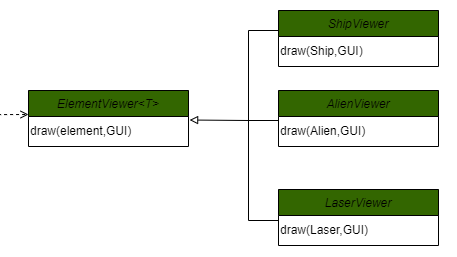

  <b><i>5. Composite pattern</i></b>

 

#### Implementation:
We created an interface _ElementViewer_, that calls the different object it wants to draw specifically. For example, the _ElementViewer_ class calls the _ShipViewer_ subclass to draw the ship specifically, but it could also call other classes to draw different objects needed to our game.

#### Consequences:
- This pattern favours the open-closed principle.
- Becomes easier to add new objects that need to be implemented in the game.

### Game loop
#### Problem:
We needed a way to keep our game running during runtime, and a way to terminate it when the player died or the window was closed.

#### Used Pattern:
The **_Game Loop Pattern_** was especially helpful to solve this issue.
It takes user input, without blocking, updates the game state and tracks the time passage in the game.

  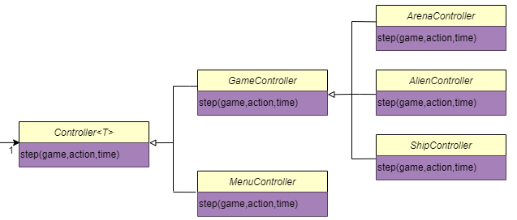

  <b><i>6. Game Loop pattern</i></b>

 

#### Implementation:
This is implemented in every single game developed. The controllers are responsible for moving the objects in the game during the loop. It takes user input, updates game state, and displays such state, restarting the loop.

#### Consequences:
- Helps controlling speed of play independent of hardware.
- Ensures better gameplay experience.

## Known Code Smells And Refactoring Suggestions
#### **Bloater**
We identified some classes as being too complex and large, such as the LanternaGUI class. It contains many methods and can be hard to understand / interpret but we find it justifiable since it is necessary for the code to run. We realised it wasn't necessary to extract these methods into its own classes as it would become harder to comprehend.

#### **Complex Changes**
When implementing the movement of different characters we came across a problem in our coding thought and so needed to change the way collision were handled.
This required many different to changes to many classes, rising the **Shotgun Surgery** smell and it was a problem getting around it. We ended up changing the way collisions worked (edges of the terminal, instead of a fixed limit), which implied changing every class that included movement (bullet, player and enemies).

#### **Duped Classes**
Our game has 2 identical classes, that only differ in code in 1 line.
The _MenuController_ and _MenuGameOverController_ are almost the same, resembling the **Duplicate Code** smell, except for the last method call. However, we didn't find necessary to change it since the classes are both concise and self-explanatory.

#### **Comment Removal**
At first, when developing the earlier stages of the game, the code was heavily commented in order to keep it understandable. We then got used to it and the comments, which were helpful beforehand, now became a nuisance and we felt the urge to remove them as they were confusing.

#### **Simplifying Conditionals**
Further into development, we noticed that some of our conditions were poorly structured and therefore needed to be made simpler. So, we tried to avoid repetition and unnecessary _else_ statements.

## Test Coverage

  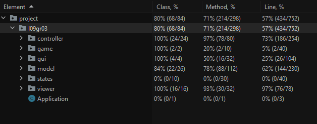

  <b><i>7. Test Coverage</i></b>

 

  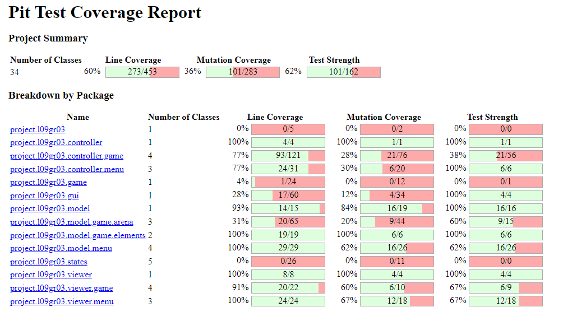

  <b><i>8. Pitest</i></b>

 

[Testing](./detail/images/html.png)

## Self-evaluation

The work was equally divided, with every member playing an important and crucial role in the game development. We feel that this project has enriched our Java knowledge and coding know-how, as well as teamwork and organization.

- Bernardo António : 33.3%
- Pedro Estela : 33.3%
- Rodrigo Rodrigues : 33.3%
